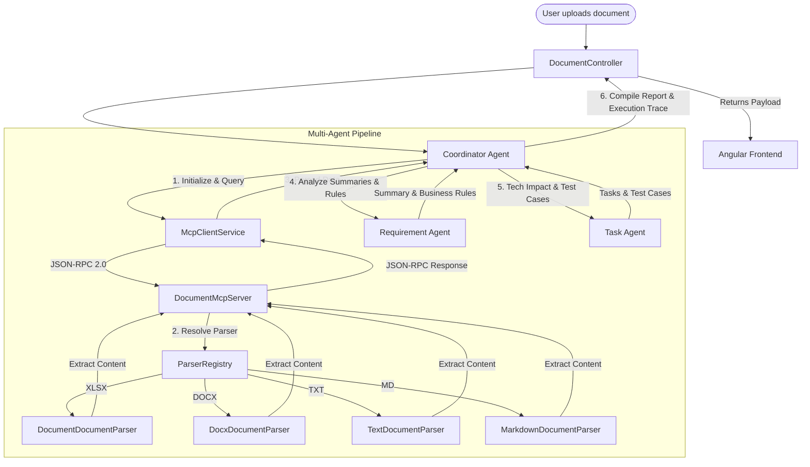

# Requirement Document Analyzer Agent

An AI-powered multi-agent system designed to automatically parse, analyze, and generate technical implementation reports from requirement documents. 

This project was built as a capstone project for the **Kaggle / Google AI Agents Intensive course**. It demonstrates the design and execution of collaborative agents, a local Model Context Protocol (MCP)-compatible architecture, and single-container deployability.

---

## 1. Project Overview

Software engineering teams often receive requirement updates as document attachments (Excel spreadsheets, Word files, text files, or Markdown files) where modifications are highlighted using yellow background colors. Manually extracting changed requirements and mapping their technical impact is time-consuming and error-prone.

The **Requirement Document Analyzer Agent** automates this process:
- **Multiple Document Format Support**: Parsers for `.xlsx`, `.docx`, `.txt`, and `.md` files.
- **Analysis Modes**:
  - **UPDATE Mode**: Focuses specifically on yellow-highlighted text spans (Word), yellow cells/rows (Excel), or full text context with a warning banner (Plain Text/Markdown).
  - **NEW Mode**: Analyzes the entire document content to bootstrap a completely new feature or system implementation.
- **Agent Trace Console**: An interactive, terminal-styled console in the UI that displays the real-time reasoning steps and interactions of the agent pipeline.

---

## 2. System Architecture

The workflow consists of an Angular SPA frontend, a Spring Boot backend controller, an MCP server exposing document tools, and a pipeline of LLM-backed agents communicating with Google's Gemini API:



---

## 3. Core Concepts Mapping

### 🤖 Multi-Agent System
The application orchestrates three specialized agents using structured, role-based prompts and sequential execution flow:
1. **Coordinator Agent**: Acts as the system manager. It initializes the document session on the MCP server, queries metadata and contents, streams trace steps, triggers the downstream agents, and compiles the final unified markdown report.
2. **Requirement Agent**: A Requirements Analyst specialist. It evaluates document extracts based on the selected mode (`NEW` or `UPDATE`). For Plain Text/Markdown updates, it flags missing highlight capabilities under a "Clarifications Needed" section.
3. **Task Agent**: A Senior Architect and QA Specialist. It translates the Requirement Agent's summary into concrete technical breakdowns matching the targeted stack (Angular frontend, Java 21/Spring Boot 3 backend), outlines development tasks, and generates comprehensive test cases (positive, negative, boundary).

### 🔌 Model Context Protocol (MCP) Compatible Server
The application strictly isolates document parsing from LLM orchestrators using the Model Context Protocol philosophy:
- Exposes a standard JSON-RPC 2.0 HTTP protocol endpoint at `/api/mcp/rpc`.
- Implements standard protocol commands: `initialize`, `tools/list`, and `tools/call`.
- Exposes four document-centric tools:
  - `getDocumentMetadata`: Returns file type, sheet/paragraph counts, and highlight availability.
  - `getChangedSections`: Extracts modified structures (Excel rows, Word paragraphs/tables containing highlight colors).
  - `getFullRequirementContent`: Extracts raw text content.
  - `getHighlightedContent`: Returns isolated highlighted text spans.
- **Zero Direct POI / Parser Access**: Agents and client-side services cannot invoke file parsers or Apache POI libraries directly. They must discover and execute tools by posting JSON-RPC payloads to the MCP Server endpoint.

### 🚀 Deployability
- **Single Deployable Unit**: The compiled production build of the Angular frontend is bundled directly into the Spring Boot static classpath (`src/main/resources/static`).
- **Single Running Port**: Both the API, MCP RPC server, and Angular UI are served from port `8080`, eliminating CORS configurations and multiple container dependencies.
- **Stateless & Database-free**: The analyzer operates in-memory on uploaded multipart files, allowing immediate deployment to serverless platforms like **Render**, **Heroku**, or **Fly.io** as a single JAR.

---

## 4. Prerequisites

To compile and run the application locally, you will need:
- **Java Development Kit (JDK) 21** or higher.
- **Maven 3.x** (or use the IDE bundled Maven package).
- **Node.js** (v18+) and **NPM** (only required if compiling frontend files manually outside the automation script).
- A **Gemini API Key** from [Google AI Studio](https://aistudio.google.com/).

---

## 5. Quick Start Guide

### Step 1: Clone and Configure Environment
Set up your Gemini API Key. The application is configured to read the key from either:
- The `GEMINI_API_KEY` system environment variable.
- A local `.env` file in the root directory (automatically excluded from Git tracking for security):
  ```env
  GEMINI_API_KEY=AIzaSyYourGeminiApiKeyHere...
  ```

### Step 2: Build the Combined Application
Run the bundled PowerShell automation script from the repository root. This script automatically builds the Angular app, copies static assets into the Spring Boot directory, and compiles the backend into a runnable fat JAR:
```powershell
PowerShell -ExecutionPolicy Bypass -File .\build-app.ps1
```

### Step 3: Run the Executable JAR
Execute the packaged JAR using Java 21:
```powershell
java -jar backend/target/excel-analyzer-0.0.1-SNAPSHOT.jar
```
The application will launch on: **`http://localhost:8080/`**

---

## 6. Verification & How to Test

### Generating Local Test Data
We have provided programmatic generators inside the test directory. You can run these generators to output test files with yellow highlights in the `backend/` directory:

1. **Generate Excel Test File** (`test_requirements.xlsx`):
   ```powershell
   mvn exec:java -Dexec.classpathScope="test" -Dexec.mainClass="com.example.excelanalyzer.DocumentGenerator"
   ```
2. **Generate Word Test File** (`test_requirements.docx`):
   ```powershell
   mvn exec:java -Dexec.classpathScope="test" -Dexec.mainClass="com.example.excelanalyzer.DocxGenerator"
   ```

### Manual Testing Scenarios
1. **Invalid File Validation**: Attempt to upload `dummy.xls` (or `.doc`/`.pdf`). Verify that the application rejects the upload and prints a banner: *"XLS files are not supported in this MVP. (XLS support is planned for future improvements)."*
2. **Excel UPDATE Mode**: Upload `test_requirements.xlsx` in **UPDATE** mode. Verify that the generated summary focuses only on the yellow-highlighted rows (SSO Login & Session Timeout).
3. **Word UPDATE Mode**: Upload `test_requirements.docx` in **UPDATE** mode. Verify that the agent successfully parses the highlighted paragraphs and table rows.
4. **Markdown UPDATE Mode**: Upload `test_requirements.md` in **UPDATE** mode. Verify that the analysis runs, lists format-specific limitations, and places *"Highlight detection is unavailable for plain text/markdown files"* inside the *Clarifications Needed* tab.
5. **Excel NEW Mode**: Upload `test_requirements.xlsx` in **NEW** mode. Verify that the agent bypasses highlights and structures a full implementation report for the entire document scope.
6. **Execution Trace Verification**: After running an analysis, click on the **Agent Execution Trace** tab. Check the terminal-styled console logs to verify the sequential steps taken by the Coordinator Agent, the tool executions on the MCP server, and responses from the agents.
